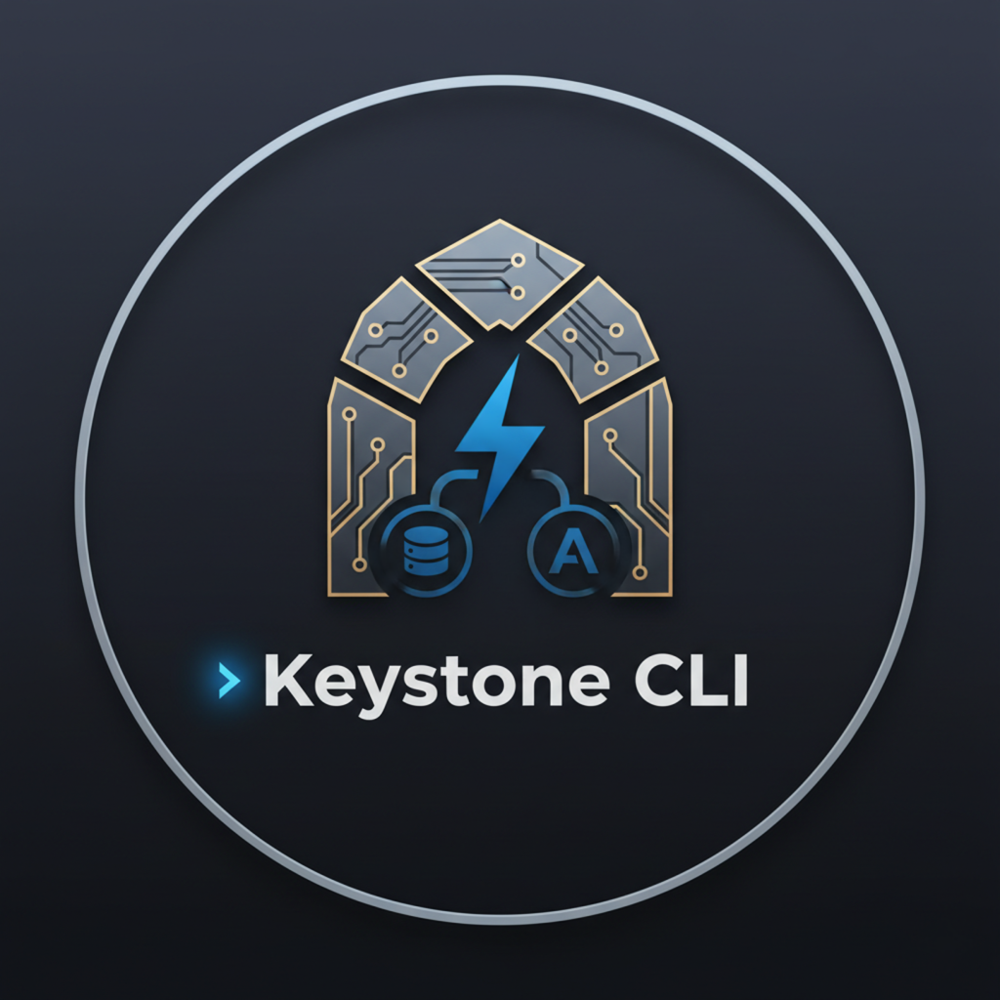
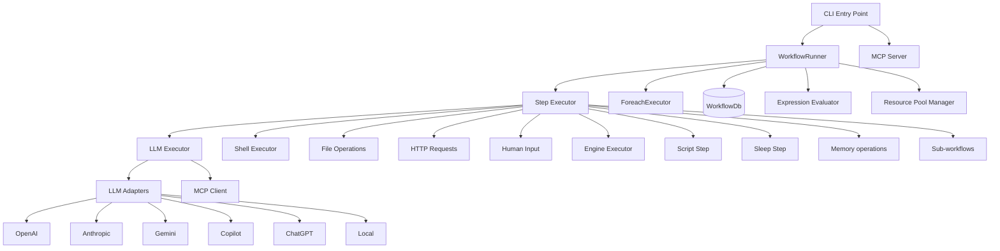

<p align="center">
  
</p>

# 🏛️ Keystone CLI

[](https://bun.sh)
[](https://www.npmjs.com/package/keystone-cli)
[](https://opensource.org/licenses/MIT)

A local-first, declarative, agentic workflow orchestrator built on **Bun**.

Keystone allows you to define complex automation workflows using a simple YAML syntax, with first-class support for LLM agents, state persistence, and parallel execution.

---

## 📚 Table of Contents

- [Features](#features)
- [Installation](#installation)
- [Quick Start](#quick-start)
- [Bundled Workflows](#bundled-workflows)
- [Configuration](#configuration)
- [Workflow Example](#workflow-example)
- [Expression Syntax](#expression-syntax)
- [Step Types](#step-types)
- [Advanced Features](#advanced-features)
- [Agent Definitions](#agent-definitions)
- [CLI Commands](#cli-commands)
- [Security](#security)
- [Architecture](#architecture)
- [Project Structure](#project-structure)
- [License](#license)

---

## ✨ Features

- ⚡ **Local-First:** Built on Bun with a local SQLite database for state management.
- 🧩 **Declarative:** Define workflows in YAML with automatic dependency tracking (DAG).
- 🤖 **Agentic:** First-class support for LLM agents defined in Markdown with YAML frontmatter.
- 🧑‍💻 **Human-in-the-Loop:** Support for manual approval and text input steps.
- 🔄 **Resilient:** Built-in retries, timeouts, and state persistence. Resume failed or paused runs exactly where they left off.
- 📊 **TUI Dashboard:** Built-in interactive dashboard for monitoring and managing runs.
- 🛠️ **Extensible:** Support for shell, file, HTTP request, LLM, and sub-workflow steps.
- 🔌 **MCP Support:** Integrated Model Context Protocol server.
- 🛡️ **Secret Redaction:** Automatically redacts environment variables and secrets from logs and outputs.
- 🧠 **Semantic Memory:** Store/search text with vector embeddings (and auto-index via `learn`).
- 🎯 **Prompt Optimization:** Iteratively optimize prompts via `keystone optimize` + workflow `eval`.

---

## 🚀 Installation

Ensure you have [Bun](https://bun.sh) installed.

### Global Install (Recommended)
```bash
bun install -g keystone-cli
```

### From Source
```bash
# Clone the repository
git clone https://github.com/mhingston/keystone-cli.git
cd keystone-cli

# Install dependencies
bun install

# Link CLI globally
bun link
```

### Shell Completion

To enable tab completion for your shell, add the following to your `.zshrc` or `.bashrc`:

**Zsh:**
```bash
source <(keystone completion zsh)
```

**Bash:**
```bash
source <(keystone completion bash)
```

---

## 🚦 Quick Start

### 1. Initialize a Project
```bash
keystone init
```
This creates the `.keystone/` directory for configuration and seeds `.keystone/workflows/` plus `.keystone/workflows/agents/` with bundled workflows and agents (see "Bundled Workflows" below).

### 2. Configure your Environment
Add your API keys to the generated `.env` file:
```env
OPENAI_API_KEY=sk-...
ANTHROPIC_API_KEY=sk-ant-...
```
Alternatively, you can use the built-in authentication management:
```bash
keystone auth login openai
keystone auth login anthropic
keystone auth login anthropic-claude
keystone auth login openai-chatgpt
keystone auth login gemini
keystone auth login github
```
Use `anthropic-claude` for Claude Pro/Max subscriptions (OAuth) instead of an API key.
Use `openai-chatgpt` for ChatGPT Plus/Pro subscriptions (OAuth) instead of an API key.
Use `gemini` (alias `google-gemini`) for Google Gemini subscriptions (OAuth) instead of an API key.
Use `github` to authenticate GitHub Copilot via the GitHub device flow.

### 3. Run a Workflow
```bash
keystone run scaffold-feature
```
Keystone automatically looks in `.keystone/workflows/` (locally and in your home directory) for `.yaml` or `.yml` files.

### 4. Monitor with the Dashboard
```bash
keystone ui
```

---

## 🧰 Bundled Workflows

`keystone init` seeds these workflows under `.keystone/workflows/` (and the agents they rely on under `.keystone/workflows/agents/`):

Top-level workflows:
- `scaffold-feature`: Interactive workflow scaffolder. Prompts for requirements, plans files, generates content, and writes them.
- `decompose-problem`: Decomposes a problem into research/implementation/review tasks, waits for approval, runs sub-workflows, and summarizes.
- `dev`: Self-bootstrapping DevMode workflow for an interactive plan/implement/verify loop.

Sub-workflows:
- `scaffold-plan`: Generates a file plan from `requirements` input.
- `scaffold-generate`: Generates file contents from `requirements` plus a `files` plan.
- `decompose-research`: Runs a single research task (`task`) with optional `context`/`constraints`.
- `decompose-implement`: Runs a single implementation task (`task`) with optional `research` findings.
- `decompose-review`: Reviews a single implementation task (`task`) with optional `implementation` results.

Example runs:
```bash
keystone run scaffold-feature
keystone run decompose-problem -i problem="Add caching to the API" -i context="Node/Bun service"
```

Sub-workflows are used by the top-level workflows, but can be run directly if you want just one phase.

---

## ⚙️ Configuration

Keystone loads configuration from project `.keystone/config.yaml` (and user-level config; see `keystone config show` for search order) to manage model providers and model mappings.

Search order (highest precedence first):
- `KEYSTONE_CONFIG`
- `.keystone/config.yaml` or `.keystone/config.yml`
- `$XDG_CONFIG_HOME/keystone/config.yaml` or `~/.config/keystone/config.yaml` (and `.yml`)

Global state (when enabled) is stored at `$XDG_DATA_HOME/keystone/state.db` or `~/.local/share/keystone/state.db`.

```yaml
default_provider: openai

providers:
  openai:
    type: openai
    base_url: https://api.openai.com/v1
    api_key_env: OPENAI_API_KEY
    default_model: gpt-4o
  openai-chatgpt:
    type: openai-chatgpt
    base_url: https://api.openai.com/v1
    default_model: gpt-5-codex
  anthropic:
    type: anthropic
    base_url: https://api.anthropic.com/v1
    api_key_env: ANTHROPIC_API_KEY
    default_model: claude-3-5-sonnet-20240620
  anthropic-claude:
    type: anthropic-claude
    base_url: https://api.anthropic.com/v1
    default_model: claude-3-5-sonnet-20240620
  google-gemini:
    type: google-gemini
    base_url: https://cloudcode-pa.googleapis.com
    default_model: gemini-3-pro-high
  groq:
    type: openai
    base_url: https://api.groq.com/openai/v1
    api_key_env: GROQ_API_KEY
    default_model: llama-3.3-70b-versatile

model_mappings:
  "gpt-5*": openai-chatgpt
  "gpt-*": openai
  "claude-4*": anthropic-claude
  "claude-*": anthropic
  "gemini-*": google-gemini
  "o1-*": openai
  "llama-*": groq

mcp_servers:
  filesystem:
    command: npx
    args: ["-y", "@modelcontextprotocol/server-filesystem", "/path/to/allowed/directory"]
  github:
    command: npx
    args: ["-y", "@modelcontextprotocol/server-github"]
    env:
      GITHUB_PERSONAL_ACCESS_TOKEN: "your-github-pat" # Or omit if GITHUB_TOKEN is in your .env

engines:
  allowlist:
    codex:
      command: codex
      version: "1.2.3"
      versionArgs: ["--version"]
  denylist: ["bash", "sh"]

storage:
  retention_days: 30
  redact_secrets_at_rest: true

expression:
  strict: false
```

`storage.retention_days` sets the default window used by `keystone maintenance` / `keystone prune`. `storage.redact_secrets_at_rest` controls whether secret inputs and known secrets are redacted before storing run data (default `true`).

### Model & Provider Resolution

Keystone resolves which provider to use for a model in the following order:

1. **Explicit Provider:** Use the `provider` field in an agent or step definition.
2. **Provider Prefix:** Use the `provider:model` syntax (e.g., `model: copilot:gpt-4o`).
3. **Model Mappings:** Matches the model name against the `model_mappings` in your config (supports suffix `*` for prefix matching).
4. **Default Provider:** Falls back to the `default_provider` defined in your config.

#### Example: Explicit Provider in Agent
**`.keystone/workflows/agents/summarizer.md`**
```markdown
---
name: summarizer
provider: anthropic
model: claude-3-5-sonnet-latest
---
```

#### Example: Provider Prefix in Step
```yaml
- id: notify
  type: llm
  agent: summarizer
  model: copilot:gpt-4o
  prompt: ...
```

### OpenAI Compatible Providers
You can add any OpenAI-compatible provider (Together AI, Perplexity, Local Ollama, etc.) by setting the `type` to `openai` and providing the `base_url` and `api_key_env`.

### GitHub Copilot Support

Keystone supports using your GitHub Copilot subscription directly. To authenticate (using the GitHub Device Flow):

```bash
keystone auth login github
```

Then, you can use Copilot in your configuration:

```yaml
providers:
  copilot:
    type: copilot
    default_model: gpt-4o
```

Authentication tokens for Copilot are managed automatically after the initial login. 

### OpenAI ChatGPT Plus/Pro (OAuth)

Keystone supports using your ChatGPT Plus/Pro subscription (OAuth) instead of an API key:

```bash
keystone auth login openai-chatgpt
```

Then map models to the `openai-chatgpt` provider in your config.

### Anthropic Claude Pro/Max (OAuth)

Keystone supports using your Claude Pro/Max subscription (OAuth) instead of an API key:

```bash
keystone auth login anthropic-claude
```

Then map models to the `anthropic-claude` provider in your config. This flow uses the Claude web auth code and refreshes tokens automatically.

### Google Gemini (OAuth)

Keystone supports using your Google Gemini subscription (OAuth) instead of an API key:

```bash
keystone auth login gemini
```

Then map models to the `google-gemini` provider in your config.

### API Key Management

For other providers, you can either store API keys in a `.env` file in your project root:
- `OPENAI_API_KEY`
- `ANTHROPIC_API_KEY`

Or use the `keystone auth login` command to securely store them in your local machine's configuration:
- `keystone auth login openai`
- `keystone auth login anthropic`

---

## 📝 Workflow Example

Workflows are defined in YAML. Dependencies are automatically resolved based on the `needs` field, and **Keystone also automatically detects implicit dependencies** from your `${{ }}` expressions.

```yaml
name: build-and-notify
description: Build the project and notify the team

inputs:
  branch:
    type: string
    default: main

steps:
  - id: checkout
    type: shell
    run: git checkout ${{ inputs.branch }}

  - id: install
    type: shell
    # Implicit dependency on 'checkout' detected from expression below
    if: ${{ steps.checkout.status == 'success' }}
    run: bun install

  - id: build
    type: shell
    needs: [install] # Explicit dependency
    run: bun run build
    retry:
      count: 3
      backoff: exponential

  - id: notify
    type: llm
    # Implicit dependency on 'build' detected from expression below
    agent: summarizer
    prompt: |
      The build for branch "${{ inputs.branch }}" was successful.
      Result: ${{ steps.build.output }}
      Please write a concise 1-sentence summary for Slack.

  - id: cleanup
    type: shell
    # Run whether previous steps succeeded or failed
    if: true
    run: rm -rf ./temp_build

finally:
  - id: final_cleanup
    type: shell
    run: echo "Workflow finished"

outputs:
  slack_message: ${{ steps.notify.output }}
```

### Expression Syntax

Keystone uses `${{ }}` syntax for dynamic values. Expressions are evaluated using a safe AST parser.

- `${{ inputs.name }}`: Access workflow inputs.
- `${{ steps.id.output }}`: Access the raw output of a previous step.
- `${{ steps.id.outputs.field }}`: Access specific fields if the output is an object.
- `${{ steps.id.status }}`: Get the execution status of a step (`'success'`, `'failed'`, etc.).
- `${{ item }}`: Access the current item in a `foreach` loop.
- `${{ args.name }}`: Access tool arguments (available ONLY inside agent tool execution steps).
- `${{ secrets.NAME }}`: Access redacted secrets.
- `${{ env.NAME }}`: Access environment variables (process env merged with workflow-level `env`).
  Workflow-level `env` is evaluated per step; if an expression cannot be resolved yet, the variable is skipped with a warning.

Inputs support `values` for enums and `secret: true` for sensitive values (redacted in logs and at rest by default; resumptions may require re-entry).

Standard JavaScript-like expressions are supported: `${{ steps.build.status == 'success' ? '🚀' : '❌' }}`.

Strict expression mode can be enabled in `.keystone/config.yaml` to fail fast on malformed `${{ }}`:
```yaml
expression:
  strict: true
```

---

## 🏗️ Step Types

Keystone supports several specialized step types:

- Any step can optionally define `inputSchema` and/or `outputSchema` (JSON Schema) to validate evaluated inputs before execution and outputs after completion.

- `shell`: Run arbitrary shell commands.
- `llm`: Prompt an agent and get structured or unstructured responses. Supports `outputSchema` (JSON Schema) for structured output.
  - `allowClarification`: Boolean (default `false`). If `true`, allows the LLM to ask clarifying questions back to the user or suspend the workflow if no human is available.
  - `maxIterations`: Number (default `10`). Maximum number of tool-calling loops allowed for the agent.
  - `allowInsecure`: Boolean (default `false`). Set `true` to allow risky tool execution.
  - `allowOutsideCwd`: Boolean (default `false`). Set `true` to allow tools to access files outside of the current working directory.
  - `handoff`: Optional engine tool definition that lets the LLM delegate work to an allowlisted external CLI with structured inputs.
- `request`: Make HTTP requests (GET, POST, etc.).
  - `allowInsecure`: Boolean (default `false`). If `true`, skips SSRF protections and allows non-HTTPS/local URLs.
  - Cross-origin redirects are blocked for non-GET/HEAD requests unless `allowInsecure: true`; on cross-origin redirects, non-essential headers are stripped.
- `file`: Read, write, or append to files.
  - `allowOutsideCwd`: Boolean (default `false`). Set `true` to allow reading/writing files outside of the current working directory.
- `human`: Pause execution for manual confirmation or text input.
  - `inputType: confirm`: Simple Enter-to-continue prompt.
  - `inputType: text`: Prompt for a string input, available via `${{ steps.id.output }}`.
- `workflow`: Trigger another workflow as a sub-step.
  - `outputMapping`: Map sub-workflow outputs to step outputs.
    ```yaml
    outputMapping:
      final_result: result_from_subflow
      status: state
    ```
- `join`: Aggregate outputs from dependencies and enforce a completion condition.
  - `target`: `'steps'` (default) or `'branches'` (for foreach).
  - `condition`: `'all'` (default), `'any'`, or a number.
- `blueprint`: Generate a structured system blueprint with an agent (persisted as an artifact).
- `script`: Run JavaScript in a sandboxed subprocess. Requires `allowInsecure: true`.
- `sleep`: Pause execution for a specified duration.
  - `durable`: Boolean (default `false`). If `true` and duration >= 60s, the wait is persisted and can resume after restarts.
- `memory`: Store or retrieve information from the semantic memory vector database.
- `engine`: Run an allowlisted external CLI and capture a structured summary.
  - `env` and `cwd` are required and must be explicit.
  - `input` is sent to stdin (objects/arrays are JSON-encoded).
  - Summary is parsed from stdout or a file at `KEYSTONE_ENGINE_SUMMARY_PATH` and stored as an artifact.

### Human Steps in Non-Interactive Mode
If stdin is not a TTY (CI, piped input), `human` steps suspend. Resume by providing an answer via inputs using the step id and `__answer`:

```bash
keystone run my-workflow --resume -i approve='{"__answer":true}'
keystone resume <run_id> -i ask='{"__answer":"hello"}'
```

Human steps remain suspended until they receive an answer; the scheduler only resumes sleep timers.

### Durable Sleeps and Scheduler
For long waits, set `durable: true` on `sleep` steps (>=60s) to persist across restarts:

```yaml
- id: wait_for_window
  type: sleep
  duration: 900000 # 15 minutes
  durable: true
```

Run the scheduler to resume runs when timers elapse:

```bash
keystone scheduler --interval 30
```

All steps support common features:
- `needs`: Array of step IDs this step depends on.
- `if`: Conditional expression.
- `retry`: `{ count, backoff: 'linear'|'exponential', baseDelay }`.
- `timeout`: Maximum execution time in milliseconds (best-effort; supported steps receive an abort signal).
- `foreach`: Iterate over an array in parallel.
- `concurrency`: Limit parallel items for `foreach` (must be a positive integer).
- `pool`: Assign step to a resource pool.
- `compensate`: Step to run if the workflow rolls back.
- `transform`: Post-process output using expressions.
- `learn`: Auto-index for few-shot.
- `reflexion`: Self-correction loop.
- `auto_heal`: LLM-powered automatic error recovery.
- `inputSchema` / `outputSchema`: JSON Schema validation.
- `outputRetries`: Max retries for output validation failures.
- `repairStrategy`: Strategy for output repair (`reask`, `repair`, `hybrid`).

Workflows also support a top-level `concurrency` field to limit how many steps can run in parallel across the entire workflow. This must resolve to a positive integer (number or expression).

### Engine Steps
Engine steps run allowlisted external CLIs and capture a structured summary for safe chaining.

**Configuration (`.keystone/config.yaml`)**
```yaml
engines:
  allowlist:
    codex:
      command: codex
      version: "1.2.3"
      versionArgs: ["--version"]
```

**Workflow example**
```yaml
- id: run_engine
  type: engine
  command: codex
  args: ["run"]
  cwd: .
  env:
    PATH: ${{ env.PATH }}
  input:
    task: "Summarize the repository"
  outputSchema:
    type: object
    properties:
      summary: { type: string }
    required: [summary]
```

The engine can optionally write a summary file to `KEYSTONE_ENGINE_SUMMARY_PATH`. Otherwise, Keystone attempts to parse JSON/YAML from stdout and stores the summary as an artifact.

### LLM Handoff to Engine
Use `handoff` to expose an engine tool to the LLM with structured inputs:

```yaml
- id: delegate
  type: llm
  agent: planner
  prompt: "Decide what to run and delegate to the engine."
  handoff:
    name: run_engine
    inputSchema:
      type: object
      properties:
        task: { type: string }
      required: [task]
    engine:
      command: codex
      args: ["run"]
      cwd: .
      env:
        PATH: ${{ env.PATH }}
      outputSchema:
        type: object
        properties:
          summary: { type: string }
        required: [summary]
```

### Self-Healing Steps
Steps can be configured to automatically recover from failures using an LLM agent.

```yaml
- id: build
  type: shell
  run: bun build
  auto_heal:
    agent: debugger_agent
    maxAttempts: 3
    model: gpt-4o # Optional override
```

When a step fails, the specified agent is invoked with the error details. The agent proposes a fix (e.g., a corrected command), and the step is automatically retried.

#### Example: Transform & Foreach Concurrency
```yaml
- id: list_files
  type: shell
  run: ls *.txt
  # Post-process stdout into an array of filenames
  transform: ${{ stdout.trim().split('\n') }}

- id: process_files
  type: shell
  foreach: ${{ steps.list_files.output }}
  concurrency: 5 # Process 5 files at a time (must be a positive integer)
  run: echo "Processing ${{ item }}"
```

#### Example: Script Step
```yaml
- id: calculate
  type: script
  allowInsecure: true
  run: |
    const data = steps.fetch_data.output;
    return data.map(i => i.value * 2).reduce((a, b) => a + b, 0);
```

---

## 🔧 Advanced Features

### Idempotency Keys

Make retries and resume operations safe for side-effecting steps by specifying an `idempotencyKey`. When a key matches a previous successful execution, the cached result is returned instead of re-executing the step.

```yaml
- id: charge_customer
  type: request
  url: https://api.stripe.com/charge
  body: { amount: 100, customer: ${{ inputs.customer_id }} }
  # Expression that evaluates to a unique key for this operation
  idempotencyKey: '"charge-" + inputs.customer_id + "-" + inputs.order_id'
  # Optional: dedupe across runs and expire after a TTL
  idempotencyScope: global
  idempotencyTtlSeconds: 86400
```

If a key is already in-flight, the step fails with an in-flight error to avoid duplicate side effects. To bypass deduplication for a run, use `keystone run --no-dedup`.

Manage idempotency records via CLI:
- `keystone dedup list` - View all idempotency records
- `keystone dedup clear <run_id>` - Clear records for a specific run
- `keystone dedup clear --all` - Clear all records
- `keystone dedup prune` - Remove expired records

### AllowFailure Pattern

Enable fail-forward steps that continue workflow execution even when they fail. Useful for agentic exploration where some attempts may naturally fail.

```yaml
- id: try_approach_a
  type: llm
  agent: explorer
  prompt: "Try approach A to solve the problem"
  allowFailure: true  # Workflow continues if this fails

- id: analyze_results
  type: llm
  agent: analyst
  prompt: |
    Approach A status: ${{ steps.try_approach_a.status }}
    Error (if any): ${{ steps.try_approach_a.error }}
    Output: ${{ steps.try_approach_a.output }}
```

The step's `status` will be `'success'` even when it fails internally, but the `error` field will contain the failure details.

### Global Errors Block

Define workflow-level error handling that runs when a step exhausts retries. Access failure context via `last_failed_step`.

```yaml
name: resilient-workflow
steps:
  - id: critical_step
    type: shell
    run: exit 1
    retry: { count: 2, backoff: exponential }

errors:
  - id: analyze_failure
    type: llm
    agent: debugger
    prompt: |
      Step ${{ last_failed_step.id }} failed with:
      Error: ${{ last_failed_step.error }}
      Suggest remediation steps.
```

The errors block runs after all retries/auto_heal are exhausted and before the `finally` block.

### Input Enums and Secrets

Constrain input values and mark sensitive data for automatic redaction.

```yaml
inputs:
  environment:
    type: string
    values: [dev, staging, prod]  # Only these values allowed
    default: dev
  api_key:
    type: string
    secret: true  # Redacted in logs and at rest
```

Schema validation errors include path-level details and are surfaced before/after step execution.

### Resource Pools

Manage concurrency for external resources (like APIs or databases) across a workflow using `pools`.

```yaml
name: rate-limited-workflow
pools:
  api_pool: 2  # Limit to 2 concurrent steps using this pool

steps:
  - id: step1
    type: request
    url: ...
    pool: api_pool
  
  - id: step2
    type: request
    url: ...
    pool: api_pool
```

### Compensations (Rollback)

Define "undo" actions for steps that have side effects. Compensations run in reverse order (LIFO) if a workflow fails or is cancelled.

```yaml
- id: create_user
  type: request
  url: https://api.example.com/users
  compensate:
    id: delete_user
    type: request
    url: https://api.example.com/users/${{ steps.create_user.outputs.id }}
    method: DELETE
```

You can also define a workflow-level `compensate` step to handle overall cleanup.

---

## 🤖 Agent Definitions

Agents are defined in Markdown files with YAML frontmatter, making them easy to read and version control.

**`.keystone/workflows/agents/summarizer.md`**
```markdown
---
name: summarizer
provider: openai
model: gpt-4o
description: Summarizes technical logs into human-readable messages
---

You are a technical communications expert. Your goal is to take technical output 
(like build logs or test results) and provide a concise, professional summary.
```

### Agent Tools

Agents can be equipped with tools, which are essentially workflow steps they can choose to execute. You can define tools in the agent definition, or directly in an LLM step within a workflow.

Keystone comes with a set of **Standard Tools** that can be enabled for any agent by setting `useStandardTools: true` in the step definition:

- `read_file`: Read the contents of a file (arguments: `path`)
- `read_file_lines`: Read a specific range of lines from a file (arguments: `path`, `start`, `count`)
- `write_file`: Write or overwrite a file (arguments: `path`, `content`)
- `list_files`: List files in a directory (arguments: `path`)
- `search_files`: Search for files by glob pattern (arguments: `pattern`, `dir`)
- `search_content`: Search for string or regex within files (arguments: `query`, `dir`, `pattern`)
- `run_command`: Run a shell command (arguments: `command`, `dir`). Risky commands require `allowInsecure: true` on the LLM step.

#### Standard Tool Examples

Agents can use these tools to interact with their environment. Here is how they appear when used by an agent:

**Read File:**
```yaml
- name: read_file
  arguments:
    path: "src/utils/logger.ts"
```

**Write File:**
```yaml
- name: write_file
  arguments:
    path: "new_file.txt"
    content: "Hello from Keystone!"
```

**Run Command:**
```yaml
- name: run_command
  arguments:
    command: "ls -la"
    dir: "."
```

Tool arguments are passed to the tool's execution step via the `args` variable.

**`.keystone/workflows/agents/developer.md`**
```markdown
---
name: developer
tools:
  - name: custom_tool
    description: A custom tool definition
    execution:
      type: shell
      run: echo "custom"
---
You are a software developer. You can use tools to explore the codebase.
```

To enable standard tools in a workflow step:

```yaml
- id: explore
  type: llm
  agent: developer
  useStandardTools: true
  prompt: "Explore the src directory"
```

### Keystone as an MCP Server

Keystone can itself act as an MCP server, allowing other agents (like Claude Desktop or GitHub Copilot) to discover and run your workflows as tools.

```bash
keystone mcp start
```

#### Sync vs Async Execution

The MCP server provides two modes for running workflows:

| Tool | Mode | Use Case |
|------|------|----------|
| `run_workflow` | **Sync** | Short workflows. Blocks until completion, returns outputs directly. |
| `start_workflow` | **Async** | Long workflows. Returns immediately with a `run_id`, use `get_run_status` to poll. |

**Example: Async execution pattern**
```
1. Agent calls start_workflow → { run_id: "abc", status: "running" }
2. Agent polls get_run_status → { status: "running" }
3. Agent polls get_run_status → { status: "completed", outputs: {...} }
```

The async pattern is ideal for LLM-heavy workflows that may take minutes to complete.

#### Global MCP Servers
Define shared MCP servers in `.keystone/config.yaml` to reuse them across different workflows. Keystone ensures that multiple steps using the same global server will share a single running process.

Keystone supports both local (stdio) and remote (SSE) MCP servers.

```yaml
mcp_servers:
  # Local server (stdio)
  filesystem:
    type: local # Default
    command: npx
    args: ["-y", "@modelcontextprotocol/server-filesystem", "/path/to/allowed/directory"]

  # Remote server (via proxy)
  atlassian:
    type: local
    command: npx
    args: ["-y", "mcp-remote", "https://mcp.atlassian.com/v1/sse"]
    timeout: 60000  # Optional connection timeout in ms
    oauth:
      scope: tools:read
```

#### Using MCP in Steps
You can use global servers, define local ones, or include all global servers at once.

```yaml
- id: analyze_code
  type: llm
  agent: developer
  # Option 1: Explicitly include global servers by name
  # Option 2: Define a local one-off server (standard object syntax)
  mcpServers:
    - filesystem 
    - name: custom-tool
      command: node
      args: ["./scripts/custom-mcp.js"]
  
  # Option 3: Automatically include ALL global servers
  useGlobalMcp: true 
  
  prompt: "Analyze the architecture of this project."
```

In these examples, the agent will have access to all tools provided by the MCP servers (like `list_directory`, `read_file`, etc.) in addition to any tools defined in the agent or the step itself.

---

## 🛠️ CLI Commands

| Command | Description |
| :--- | :--- |
| `init` | Initialize a new Keystone project |
| `run <workflow>` | Execute a workflow (use `-i key=val`, `--resume` to auto-resume, `--dry-run`, `--debug`, `--no-dedup`, `--explain`) |
| `resume <run_id>` | Resume a failed/paused/crashed workflow by ID (use `-i key=val` to answer human steps) |
| `rerun <workflow>` | Rerun a workflow from a specific step (use `--from <step_id>` and optional `--run <run_id>`) |
| `validate [path]` | Check workflow files for errors |
| `lint [path]` | Alias for `validate` |
| `workflows` | List available workflows |
| `history` | Show recent workflow runs |
| `logs <run_id>` | View logs, outputs, and errors for a specific run (`-v` for full output) |
| `graph <workflow>` | Generate a Mermaid diagram of the workflow |
| `test [path]` | Run workflow tests with fixtures and snapshots |
| `optimize <workflow>` | Optimize a specific step in a workflow (requires --target and workflow `eval`) |
| `compile` | Compile a project into a single executable with embedded assets |
| `dev <task>` | Run the self-bootstrapping DevMode workflow |
| `manifest` | Show embedded assets manifest |
| `config show` | Show current configuration and discovery paths (alias: `list`) |
| `auth status [provider]` | Show authentication status |
| `auth login [provider]` | Login to an authentication provider (github, openai, anthropic, openai-chatgpt, anthropic-claude, gemini/google-gemini) |
| `auth logout [provider]` | Logout and clear authentication tokens |
| `ui` | Open the interactive TUI dashboard |
| `mcp start` | Start the Keystone MCP server |
| `mcp login <server>` | Login to a remote MCP server |
| `scheduler` | Run the durable timer scheduler to resume sleep timers |
| `timers list` | List durable timers |
| `timers clear` | Clear durable timers by run ID or `--all` |
| `dedup list [run_id]` | List idempotency records (optionally filter by run) |
| `dedup clear <target>` | Clear idempotency records by run ID or `--all` |
| `dedup prune` | Remove expired idempotency records |
| `completion [shell]` | Generate shell completion script (zsh, bash) |
| `maintenance [--days N]` | Perform database maintenance (prune old runs and vacuum) |
| `prune [--days N]` | Alias for `maintenance` |

---

### Compile
`keystone compile -o ./keystone-app` emits the executable plus a `keystone-runtime/` directory next to it.
Ship both together if you use memory/embeddings (the runtime folder includes native deps like ONNX Runtime,
sqlite-vec, and sharp). The compile step also copies native shared libraries (for example `libonnxruntime.*`
and `vec0.*`) next to the binary. You can move the runtime folder and set `KEYSTONE_RUNTIME_DIR` to point
to it. If you move the ONNX Runtime library elsewhere, set `KEYSTONE_ONNX_RUNTIME_LIB_DIR` to that directory.
If you do not use memory/embeddings, the binary alone is sufficient. If you see cache warnings from local
embeddings in a compiled run, set `TRANSFORMERS_CACHE` to a writable directory.

Input keys passed via `-i key=val` must be alphanumeric/underscore and cannot be `__proto__`, `constructor`, or `prototype`.

### Dry Run
`keystone run --dry-run` prints shell commands without executing them and skips non-shell steps (including human prompts). Outputs from skipped steps are empty, so conditional branches may differ from a real run.

## 🛡️ Security

### Shell Execution
Keystone blocks shell commands that match common injection/destructive patterns (like `rm -rf /` or pipes to shells). To run them, set `allowInsecure: true` on the step. Prefer `${{ escape(...) }}` when interpolating user input.

You can bypass this check if you trust the command:
```yaml
- id: deploy
  type: shell
  run: ./deploy.sh ${{ inputs.env }}
  allowInsecure: true
```

### Expression Safety
Expressions `${{ }}` are evaluated using a safe AST parser (`jsep`) which:
- Prevents arbitrary code execution (no `eval` or `Function`).
- Whitelists safe global objects (`Math`, `JSON`, `Date`, etc.).
- Blocks access to sensitive properties (`constructor`, `__proto__`).
- Enforces a maximum template length to prevent ReDoS attacks.

### Script Sandboxing
Script steps run in a separate subprocess by default. This reduces risk but is **not a security boundary** for malicious code. Script steps are disabled by default; set `allowInsecure: true` to run them.

### HTTP Requests
Request steps enforce SSRF protections and require HTTPS by default. Cross-origin redirects are blocked for non-GET/HEAD requests unless `allowInsecure: true`, and non-essential headers are stripped on cross-origin redirects.

---

## 🏗️ Architecture



## 📂 Project Structure

- `src/cli.ts`: CLI entry point.
- `src/db/`: SQLite persistence layer.
- `src/runner/`: The core execution engine, handles parallelization and retries.
- `src/parser/`: Zod-powered validation for workflows and agents.
- `src/expression/`: `${{ }}` expression evaluator.
- `src/templates/`: Bundled workflow and agent templates.
- `src/ui/`: Ink-powered TUI dashboard.
- `src/utils/`: Shared utilities (auth, redaction, config loading).
- `src/types/`: Core type definitions.
- `src/e2e-tests/`: End-to-end test suite.
- `.keystone/workflows/`: Your YAML workflow definitions.

---

## 📄 License

MIT
