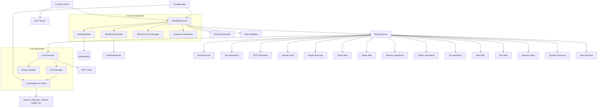

<p align="center">
  
</p>

# 🏛️ Keystone CLI

[](https://bun.sh)
[](https://www.npmjs.com/package/keystone-cli)
[](https://opensource.org/licenses/MIT)
[](https://deepwiki.com/mhingston/keystone-cli)

A local-first, declarative, agentic workflow orchestrator built on **Bun**.

Keystone allows you to define complex automation workflows using a simple YAML syntax, with first-class support for LLM agents, state persistence, and parallel execution.

<div align="center">
  [](https://www.youtube.com/watch?v=El1nwSo0h1Y)
</div>

---

## 📚 Table of Contents

- [Features](#features)
- [Installation](#installation)
- [Quick Start](#quick-start)
- [Bundled Workflows](#bundled-workflows)
- [Configuration](#configuration)
- [Workflow Example](#workflow-example)
- [Expression Syntax](#expression-syntax)
- [Step Types](#step-types)
- [Advanced Features](#advanced-features)
- [Agent Definitions](#agent-definitions)
- [CLI Commands](#cli-commands)
- [Security](#security)
- [Architecture](#architecture)
- [Project Structure](#project-structure)
- [License](#license)

---

## <a id="features">✨ Features</a>

- ⚡ **Local-First:** Built on Bun with a local SQLite database for state management.
- 🧩 **Declarative:** Define workflows in YAML with automatic dependency tracking (DAG).
- 🤖 **Agentic:** First-class support for LLM agents defined in Markdown with YAML frontmatter.
- 🎯 **Dynamic Workflows:** LLM-driven orchestration where a supervisor generates and executes steps at runtime.
- 🧑‍💻 **Human-in-the-Loop:** Support for manual approval and text input steps.
- 🔄 **Resilient:** Built-in retries, timeouts, and state persistence. Resume failed or paused runs exactly where they left off.
- 📊 **TUI Dashboard:** Built-in interactive dashboard for monitoring and managing runs.
- 🛠️ **Extensible:** Support for shell, file, HTTP request, LLM, and sub-workflow steps.
- 🔌 **MCP Support:** Integrated Model Context Protocol server.
- 🛡️ **Secret Redaction:** Automatically redacts environment variables and secrets from logs and outputs.
- 🧠 **Semantic Memory:** Store/search text with vector embeddings (and auto-index via `learn`).
- 🎯 **Prompt Optimization:** Iteratively optimize prompts via `keystone optimize` + workflow `eval`.
- 📖 **Documentation Generator:** Automatically generate Markdown documentation from your workflow definitions.

---

## <a id="installation">🚀 Installation</a>

Ensure you have [Bun](https://bun.sh) installed.

### Global Install (Recommended)
```bash
bun install -g keystone-cli
```

### From Source
```bash
# Clone the repository
git clone https://github.com/mhingston/keystone-cli.git
cd keystone-cli

# Install dependencies
bun install

# Link CLI globally
bun link
```

### Shell Completion

To enable tab completion for your shell, add the following to your `.zshrc` or `.bashrc`:

**Zsh:**
```bash
source <(keystone completion zsh)
```

**Bash:**
```bash
source <(keystone completion bash)
```

---

## <a id="quick-start">🚦 Quick Start</a>

### 1. Initialize a Project
```bash
keystone init
```
This creates the `.keystone/` directory for configuration and seeds `.keystone/workflows/` plus `.keystone/workflows/agents/` with bundled workflows and agents (see "Bundled Workflows" below).

### 2. Install AI SDK Providers
Keystone uses the **Vercel AI SDK**. Install the provider packages you need:
```bash
npm install @ai-sdk/openai @ai-sdk/anthropic
# Or use other AI SDK providers like @ai-sdk/google, @ai-sdk/mistral, etc.
```

### 3. Configure Providers
Edit `.keystone/config.yaml` to configure your providers:
```yaml
default_provider: openai

providers:
  openai:
    package: "@ai-sdk/openai"
    api_key_env: OPENAI_API_KEY
    default_model: gpt-4o
  
  anthropic:
    package: "@ai-sdk/anthropic"
    api_key_env: ANTHROPIC_API_KEY
    default_model: claude-3-5-sonnet-20240620

model_mappings:
  "gpt-*": openai
  "claude-*": anthropic
```

Then add your API keys to `.env`:
```env
OPENAI_API_KEY=sk-...
ANTHROPIC_API_KEY=sk-ant-...
```

See the [Configuration](#configuration) section for more details on BYOP (Bring Your Own Provider).

### 4. Run a Workflow
```bash
keystone run scaffold-feature
```
Keystone automatically looks in `.keystone/workflows/` (locally and in your home directory) for `.yaml` or `.yml` files.

### 5. Monitor with the Dashboard
```bash
keystone ui
```

---

## <a id="bundled-workflows">🧰 Bundled Workflows</a>

`keystone init` seeds these workflows under `.keystone/workflows/` (and the agents they rely on under `.keystone/workflows/agents/`):

Top-level utility workflows (seeded in `.keystone/workflows/`):
- `scaffold-feature.yaml`: Interactive workflow scaffolder. Prompts for requirements, plans files, generates content, and writes them.
- `decompose-problem.yaml`: Decomposes a problem into research/implementation/review tasks, waits for approval, runs sub-workflows, and summarizes.
- `dev.yaml`: Self-bootstrapping DevMode workflow for an interactive plan/implement/verify loop.
- `dynamic-decompose.yaml`: Dynamic version of decompose-problem using LLM-driven orchestration.

Sub-workflows (seeded in `.keystone/workflows/`):
- `scaffold-plan.yaml`: Generates a file plan from `requirements` input.
- `scaffold-generate.yaml`: Generates file contents from `requirements` plus a `files` plan.
- `decompose-research.yaml`: Runs a single research task (`task`) with optional `context`/`constraints`.
- `decompose-implement.yaml`: Runs a single implementation task (`task`) with optional `research` findings.
- `decompose-review.yaml`: Reviews a single implementation task (`task`) with optional `implementation` results.
- `review-loop.yaml`: Reusable generate → critique → refine loop with a quality gate.

Example runs:
```bash
keystone run scaffold-feature
keystone run decompose-problem -i problem="Add caching to the API" -i context="Node/Bun service"
keystone run dev "Improve the user profile UI"
```

Sub-workflows are used by the top-level workflows, but can be run directly if you want just one phase.

---

## <a id="configuration">⚙️ Configuration</a>

Keystone loads configuration from project `.keystone/config.yaml` (and user-level config; see `keystone config show` for search order) to manage model providers and model mappings.

Search order (highest precedence first):
- `KEYSTONE_CONFIG`
- `.keystone/config.yaml` or `.keystone/config.yml`
- `$XDG_CONFIG_HOME/keystone/config.yaml` or `~/.config/keystone/config.yaml` (and `.yml`)

State is stored at `.keystone/state.db` by default (project-local).

```yaml
default_provider: openai

providers:
  # Example: Using a standard AI SDK provider package (Bring Your Own Provider)
  openai:
    package: "@ai-sdk/openai"
    base_url: https://api.openai.com/v1
    api_key_env: OPENAI_API_KEY
    default_model: gpt-4o

  # Example: Using another provider
  anthropic:
    package: "@ai-sdk/anthropic"
    api_key_env: ANTHROPIC_API_KEY
    default_model: claude-3-5-sonnet-20240620

  # Example: Using a custom provider script
  # my-custom-provider:
  #   script: "./providers/my-provider.ts"
  #   default_model: my-special-model

model_mappings:
  "gpt-*": openai
  "claude-*": anthropic

mcp_servers:
  filesystem:
    command: npx
    args: ["-y", "@modelcontextprotocol/server-filesystem", "/path/to/allowed/directory"]
  github:
    command: npx
    args: ["-y", "@modelcontextprotocol/server-github"]
    env:
      GITHUB_PERSONAL_ACCESS_TOKEN: "your-github-pat" # Or omit if GITHUB_TOKEN is in your .env

engines:
  allowlist:
    codex:
      command: codex
      version: "1.2.3"
      versionArgs: ["--version"]
  denylist: ["bash", "sh"]

storage:
  retention_days: 30
  redact_secrets_at_rest: true

expression:
  strict: false

logging:
  suppress_security_warning: false
  suppress_ai_sdk_warnings: false
```

### Storage Configuration

The `storage` section controls data retention and security for workflow runs:

- **`retention_days`**: Sets the default window used by `keystone maintenance` / `keystone prune` commands to clean up old run data.
- **`redact_secrets_at_rest`**: Controls whether secret inputs and known secrets are redacted before storing run data (default `true`).

### Logging Configuration

The `logging` section allows you to suppress warnings:

- **`suppress_security_warning`**: Silences the "Security Warning" about running workflows from untrusted sources (default `false`).
- **`suppress_ai_sdk_warnings`**: Silences internal warnings from the Vercel AI SDK, such as compatibility mode messages (default `false`).

### Bring Your Own Provider (BYOP)

Keystone uses the **Vercel AI SDK**, allowing you to use any compatible provider. You must install the provider package (e.g., `@ai-sdk/openai`, `ai-sdk-provider-gemini-cli`) so Keystone can resolve it.

Keystone searches for provider packages in:
1.  **Local `node_modules`**: The project where you run `keystone`.
2.  **Global `node_modules`**: Your system-wide npm/bun/yarn directory.

To install a provider globally:
```bash
bun install -g ai-sdk-provider-gemini-cli
# or
npm install -g @ai-sdk/openai
```

Then configure it in `.keystone/config.yaml` using the `package` field.

### Model & Provider Resolution

Keystone resolves which provider to use for a model in the following order:

1. **Explicit Provider:** Use the `provider` field in an agent or step definition.
2. **Provider Prefix:** Use the `provider:model` syntax (e.g., `model: anthropic:claude-3-5-sonnet-latest`).
3. **Model Mappings:** Matches the model name against the `model_mappings` in your config (supports suffix `*` for prefix matching).
4. **Default Provider:** Falls back to the `default_provider` defined in your config.

#### Example: Explicit Provider in Agent
**`.keystone/workflows/agents/summarizer.md`**
```markdown
---
name: summarizer
provider: anthropic
model: claude-3-5-sonnet-latest
---
```

#### Example: Provider Prefix in Step
```yaml
- id: notify
  type: llm
  agent: summarizer
  model: anthropic:claude-3-5-sonnet-latest
  prompt: ...
```

### OpenAI Compatible Providers
You can add any OpenAI-compatible provider (Together AI, Perplexity, Local Ollama, etc.) by using the `@ai-sdk/openai` package and providing the `base_url` and `api_key_env`.

```yaml
providers:
  ollama:
    package: "@ai-sdk/openai"
    base_url: http://localhost:11434/v1
    api_key_env: OLLAMA_API_KEY  # Can be any value for local Ollama
    default_model: llama3.2
```

### API Key Management

For other providers, store API keys in a `.env` file in your project root:
- `OPENAI_API_KEY`
- `ANTHROPIC_API_KEY`

### Context Injection (Opt-in)

Keystone can automatically inject project context files (`README.md`, `AGENTS.md`, `.cursor/rules`, `.claude/rules`) into LLM system prompts. This helps agents understand your project's conventions and guidelines.

```yaml
features:
  context_injection:
    enabled: true              # Opt-in feature (default: false)
    search_depth: 3            # How many directories up to search (default: 3)
    sources:                   # Which context sources to include
      - readme                 # README.md files
      - agents_md              # AGENTS.md files
      - cursor_rules           # .cursor/rules or .claude/rules
```

When enabled, Keystone will:
1. Search from the workflow directory up to the project root
2. Find the nearest `README.md` and `AGENTS.md` files
3. Parse rules from `.cursor/rules` or `.claude/rules` directories
4. Prepend this context to the LLM system prompt

Context is cached for 1 minute to avoid redundant file reads.


---

## <a id="workflow-example">📝 Workflow Example</a>

Workflows are defined in YAML. Dependencies are automatically resolved based on the `needs` field, and **Keystone also automatically detects implicit dependencies** from your `${{ }}` expressions.

```yaml
name: build-and-notify
description: Build the project and notify the team

inputs:
  branch:
    type: string
    default: main

steps:
  - id: checkout
    type: shell
    run: git checkout ${{ inputs.branch }}

  - id: install
    type: shell
    # Implicit dependency on 'checkout' detected from expression below
    if: ${{ steps.checkout.status == 'success' }}
    run: bun install

  - id: build
    type: shell
    needs: [install] # Explicit dependency
    run: bun run build
    retry:
      count: 3
      backoff: exponential

  - id: notify
    type: llm
    # Implicit dependency on 'build' detected from expression below
    agent: summarizer
    prompt: |
      The build for branch "${{ inputs.branch }}" was successful.
      Result: ${{ steps.build.output }}
      Please write a concise 1-sentence summary for Slack.

  - id: cleanup
    type: shell
    # Run whether previous steps succeeded or failed
    if: true
    run: rm -rf ./temp_build

finally:
  - id: final_cleanup
    type: shell
    run: echo "Workflow finished"

outputs:
  slack_message: ${{ steps.notify.output }}
```

### Expression Syntax

Keystone uses `${{ }}` syntax for dynamic values. Expressions are evaluated using a safe AST parser.

- `${{ inputs.name }}`: Access workflow inputs.
- `${{ steps.id.output }}`: Access the raw output of a previous step.
- `${{ steps.id.outputs.field }}`: Access specific fields if the output is an object.
- `${{ steps.id.status }}`: Get the execution status of a step (`'success'`, `'failed'`, etc.).
- `${{ item }}`: Access the current item in a `foreach` loop.
- `${{ args.name }}`: Access tool arguments (available ONLY inside agent tool execution steps).
- `${{ secrets.NAME }}`: Access secret values (redacted in logs and at rest).
- `${{ env.NAME }}`: Access environment variables (process env merged with workflow-level `env`).
  Workflow-level `env` is evaluated per step; if an expression cannot be resolved yet, the variable is skipped with a warning.
- `${{ memory.key }}`: Access mutable workflow memory (populated by tools via `__keystone_context`).

Inputs support `values` for enums and `secret: true` for sensitive values (redacted in logs and at rest by default; resumptions may require re-entry).

Standard JavaScript-like expressions are supported: `${{ steps.build.status == 'success' ? '🚀' : '❌' }}`.

Strict expression mode can be enabled in `.keystone/config.yaml` to fail fast on malformed `${{ }}`:
```yaml
expression:
  strict: true
```

> [!NOTE]
> When `strict: false` (default), evaluation errors in outputs will be reported as warnings and the value will be set to `null` to allow the workflow to potentially continue.

---

## <a id="step-types">🏗️ Step Types</a>

Keystone supports several specialized step types:

- Any step can optionally define `inputSchema` and/or `outputSchema` (JSON Schema) to validate evaluated inputs before execution and outputs after completion.

- `shell`: Run arbitrary shell commands.
- `llm`: Prompt an agent and get structured or unstructured responses. Supports `outputSchema` (JSON Schema) for structured output.
  - `allowClarification`: Boolean (default `false`). If `true`, allows the LLM to ask clarifying questions back to the user or suspend the workflow if no human is available.
  - `allowedHandoffs`: Optional list of agent names that can be transferred to via `transfer_to_agent`.
  - `maxIterations`: Number (default `10`). Maximum number of tool-calling loops allowed for the agent.
  - `maxMessageHistory`: Number (default `50`). Max messages to retain in history before truncation/summary.
  - `contextStrategy`: `'truncate'|'summary'|'auto'` (default `truncate`). Summarizes older history into a system message when limits are exceeded.
  - `qualityGate`: Optional reviewer config `{ agent, prompt?, provider?, model?, maxAttempts? }`. If review fails, the step is refined and re-run.
  - `allowOutsideCwd`: Boolean (default `false`). Set `true` to allow tools to access files outside of the current working directory.
  - `handoff`: Optional engine tool definition that lets the LLM delegate work to an allowlisted external CLI with structured inputs.
- `plan`: Create a dynamic task list for orchestration.
  - `goal`: Required planning goal (string).
  - `context` / `constraints`: Optional strings to guide the plan.
  - `prompt`: Optional override of the planning prompt.
  - Plan steps accept the same LLM options as `llm`, including tools, handoffs, and `allowedHandoffs`.
- `request`: Make HTTP requests (GET, POST, etc.).
  - Cross-origin redirects are blocked for non-GET/HEAD requests; on cross-origin redirects, non-essential headers are stripped for security.
- `file`: Read, write, append, or patch files.
  - `allowOutsideCwd`: Boolean (default `false`). Set `true` to allow reading/writing files outside of the current working directory.
  - `op: patch`: Apply a unified diff or search/replace blocks via `content`.
    - Search/replace blocks use `<<<<<<< SEARCH`, `=======`, `>>>>>>> REPLACE` and must match exactly once.
- `artifact`: Upload or download files as named artifacts.
  - `op: upload`: Requires `name` and `paths` (glob patterns).
  - `op: download`: Requires `name` and `path` (destination directory).
  - `allowOutsideCwd`: Boolean (default `false`). Set `true` to allow paths outside of the current working directory.
- `human`: Pause execution for manual confirmation or text input.
  - `inputType: confirm`: Simple Enter-to-continue prompt.
  - `inputType: text`: Prompt for a string input, available via `${{ steps.id.output }}`.
- `workflow`: Trigger another workflow as a sub-step.
  - `outputMapping`: Map sub-workflow outputs to step outputs.
    ```yaml
    outputMapping:
      final_result: result_from_subflow
      # 'from' can be used for explicit mapping or expression
      # status: { from: "steps.some_step.status" }
    ```
- `join`: Aggregate outputs from dependencies and enforce a completion condition.
  - `condition`: `'all'` (default), `'any'`, or a number.
  - `target`: Reserved for future use; currently ignored.
- `blueprint`: Generate a structured system blueprint with an agent (persisted as an artifact).
- `script`: Run JavaScript in a sandboxed subprocess.
- `sleep`: Pause execution for a specified duration or until a timestamp.
  - `duration`: Milliseconds (number or expression).
  - `until`: Date/time string (evaluated), parsed by `Date`.
  - `durable`: Boolean (default `false`). If `true` and duration >= 60s, the wait is persisted and can resume after restarts.
- `wait`: Pause execution until an event is triggered.
  - `event`: Event name (string or expression).
  - `oneShot`: Boolean (default `true`). If `true`, consumes the event after it fires.
- `memory`: Store or retrieve information from the semantic memory vector database.
  - `op: store`: Store text with metadata.
  - `op: search`: Search for similar text using vector embeddings.
  - `text` / `query`: The content to store or search for.
  - `model`: Optional embedding model (defaults to `local`). Currently only local embeddings (via `Transformers.js`) are supported.
  - `metadata`: Optional object for filtering or additional context.
  - `limit`: Number of results to return (default `5`).
  ```yaml
  - id: remember_preference
    type: memory
    op: store
    text: "User prefers dark mode"
    metadata: { user: "alice" }

  - id: recall_preference
    type: memory
    op: search
    query: "What is the user's preference?"
    limit: 1
  ```
- `engine`: Run an allowlisted external CLI and capture a structured summary.
  - `env` and `cwd` are required and must be explicit.
  - `input` is sent to stdin (objects/arrays are JSON-encoded).
  - Summary is parsed from stdout or a file at `KEYSTONE_ENGINE_SUMMARY_PATH` and stored as an artifact.
- `git`: Execute git operations with automatic worktree management.
  - Operations: `clone`, `checkout`, `pull`, `push`, `commit`, `worktree_add`, `worktree_remove`.
  - `cleanup: true` automatically removes worktrees at workflow end.
  ```yaml
  - id: clone_repo
    type: git
    op: clone
    url: https://github.com/example/repo.git
    path: ./repo
    branch: main
    cleanup: true
  ```
- `dynamic`: LLM-driven workflow orchestration where a supervisor agent generates steps at runtime.
  - The supervisor LLM creates a plan of steps that are then executed dynamically.
  - Supports resumability - state is persisted after each generated step.
  - Generated steps can be: `llm`, `shell`, `workflow`, `file`, or `request`.
  - `goal`: High-level goal for the supervisor to accomplish (required).
  - `context`: Additional context for planning.
  - `prompt`: Custom supervisor prompt (overrides default).
  - `supervisor`: Agent for planning (defaults to `keystone-architect`).
  - `agent`: Default agent for generated LLM steps.
  - `templates`: Role-to-agent mapping for specialized tasks.
  - `maxSteps`: Maximum number of steps to generate.
  - `concurrency`: Maximum number of steps to run in parallel (default: `1`).
  - `confirmPlan`: Review and approve/modify the plan before execution (default: `false`).
  - `maxReplans`: Number of automatic recovery attempts if the plan fails (default: `3`).
  - `allowStepFailure`: Continue execution even if individual generated steps fail.
  - `library`: A list of pre-defined step patterns available to the supervisor.
  ```yaml
  - id: implement_feature
    type: dynamic
    goal: "Implement user authentication with JWT"
    context: "This is a Node.js Express application"
    agent: keystone-architect
    templates:
      planner: "keystone-architect"
      developer: "software-engineer"
    maxSteps: 10
    allowStepFailure: false
  ```

#### Dynamic Orchestration vs. Rigid Pipelines
Traditional workflows often require complex multi-file decomposition (e.g., `decompose-problem.yaml` calling separate research, implementation, and review workflows). The `dynamic` step type replaces these rigid patterns with **Agentic Orchestration**:
- **Simplified Structure**: A single `dynamic` step can replace multiple nested pipelines.
- **Adaptive Execution**: The agent adjusts its plan based on real-time feedback and results from previous steps.
- **Improved Resumability**: Each sub-step generated by the agent is persisted, allowing seamless resumption even inside long-running dynamic tasks.

Use **Deterministic Workflows** (standard steps) for predictable, repeatable processes. Use **Dynamic Orchestration** for open-ended tasks where the specific steps cannot be known in advance.

### Human Steps in Non-Interactive Mode
If stdin is not a TTY (CI, piped input), `human` steps suspend. Resume by providing an answer via inputs using the step id and `__answer`:

```bash
keystone run my-workflow --resume -i approve='{"__answer":true}'
keystone resume <run_id> -i ask='{"__answer":"hello"}'
```

Human steps remain suspended until they receive an answer; the scheduler only resumes sleep timers.

### Durable Sleeps and Scheduler
For long waits, set `durable: true` on `sleep` steps (>=60s) to persist across restarts:

```yaml
- id: wait_for_window
  type: sleep
  duration: 900000 # 15 minutes
  durable: true
```

Run the scheduler to resume runs when timers elapse:

```bash
keystone scheduler --interval 30
```

All steps support common features:
- `needs`: Array of step IDs this step depends on.
- `if`: Conditional expression.
- `retry`: `{ count, backoff: 'linear'|'exponential', baseDelay }`.
- `timeout`: Maximum execution time in milliseconds (best-effort; supported steps receive an abort signal).
- `foreach`: Iterate over an array in parallel.
- `concurrency`: Limit parallel items for `foreach` (must be a positive integer). Defaults to `50`.
- `strategy.matrix`: Multi-axis expansion into `foreach` at parse-time.
- `pool`: Assign step to a resource pool.
- `breakpoint`: Pause before executing the step when running with `--debug`.
- `compensate`: Step to run if the workflow rolls back.
- `transform`: Post-process output using expressions.
- `learn`: Auto-index for few-shot.
- `reflexion`: Self-correction loop.
- `auto_heal`: LLM-powered automatic error recovery.
- `memoize`: Cache step outputs across runs (`memoizeTtlSeconds` controls expiry).
- `inputSchema` / `outputSchema`: JSON Schema validation.
- `outputRetries`: Max retries for output validation failures.
- `repairStrategy`: Strategy for output repair (`reask`, `repair`, `hybrid`).

> [!TIP]
> **Performance Optimization**: For `foreach` steps with very large datasets, Keystone may automatically skip output aggregation to prevent memory issues. Use file-based storage or external databases if you need to process tens of thousands of items.

Workflows also support a top-level `concurrency` field to limit how many steps can run in parallel across the entire workflow. This must resolve to a positive integer (number or expression).

### Engine Steps
Engine steps run allowlisted external CLIs and capture a structured summary for safe chaining.

**Configuration (`.keystone/config.yaml`)**
```yaml
engines:
  allowlist:
    codex:
      command: codex
      version: "1.2.3"
      versionArgs: ["--version"]
```

**Workflow example**
```yaml
- id: run_engine
  type: engine
  command: codex
  args: ["run"]
  cwd: .
  env:
    PATH: ${{ env.PATH }}
  input:
    task: "Summarize the repository"
  outputSchema:
    type: object
    properties:
      summary: { type: string }
    required: [summary]
```

The engine can optionally write a summary file to `KEYSTONE_ENGINE_SUMMARY_PATH`. Otherwise, Keystone attempts to parse JSON/YAML from stdout and stores the summary as an artifact.

### LLM Handoff to Engine
Use `handoff` to expose an engine tool to the LLM with structured inputs:

```yaml
- id: delegate
  type: llm
  agent: planner
  prompt: "Decide what to run and delegate to the engine."
  handoff:
    name: run_engine
    inputSchema:
      type: object
      properties:
        task: { type: string }
      required: [task]
    engine:
      command: codex
      args: ["run"]
      cwd: .
      env:
        PATH: ${{ env.PATH }}
      outputSchema:
        type: object
        properties:
          summary: { type: string }
        required: [summary]
```

### Agent Handoffs (Swarm-Style)
Allow the LLM to switch to a specialist agent mid-step by defining `allowedHandoffs`. This injects a standard tool `transfer_to_agent({ agent_name })` and swaps the system prompt + tool set while preserving conversation history.

```yaml
- id: route
  type: llm
  agent: handoff-router
  prompt: "Route the task, then answer."
  allowedHandoffs: [handoff-specialist]
```

To prevent infinite loops, handoffs are limited to **20** occurrences per step by default.

Agent prompts can use `${{ }}` expressions (evaluated against the workflow context) for dynamic system prompts.

```markdown
---
name: handoff-specialist
---
You are the specialist for ${{ inputs.topic }}.
```

### Tool-Driven Context Updates
Tools can return `__keystone_context` to update workflow memory/env immediately. These values become available to subsequent tool calls and steps via `${{ memory.* }}` and `${{ env.* }}`.

```json
{
  "__keystone_context": {
    "memory": { "user": "Ada" },
    "env": { "CURRENT_TOPIC": "billing" }
  },
  "stored": true
}
```

### Self-Healing Steps
Steps can be configured to automatically recover from failures using an LLM agent.

```yaml
- id: build
  type: shell
  run: bun build
  auto_heal:
    agent: debugger_agent
    maxAttempts: 3
    model: gpt-4o # Optional override
```

When a step fails, the specified agent is invoked with the error details. The agent proposes a fix (e.g., a corrected command), and the step is automatically retried.

#### Example: Transform & Foreach Concurrency
```yaml
- id: list_files
  type: shell
  run: ls *.txt
  # Post-process stdout into an array of filenames
  transform: ${{ stdout.trim().split('\n') }}

- id: process_files
  type: shell
  foreach: ${{ steps.list_files.output }}
  concurrency: 5 # Process 5 files at a time (must be a positive integer)
  run: echo "Processing ${{ item }}"
```

#### Example: Matrix Strategy (manual foreach)
Until `strategy.matrix` is wired end-to-end, use explicit `foreach` with an array expression:

```yaml
- id: test_matrix
  type: shell
  foreach: ${{ [
    { node: 18, os: "ubuntu" },
    { node: 18, os: "macos" },
    { node: 20, os: "ubuntu" },
    { node: 20, os: "macos" },
    { node: 22, os: "ubuntu" },
    { node: 22, os: "macos" }
  ] }}
  run: echo "node=${{ item.node }} os=${{ item.os }}"
```

#### Example: Script Step
```yaml
- id: calculate
  type: script
  run: |
    const data = steps.fetch_data.output;
    return data.map(i => i.value * 2).reduce((a, b) => a + b, 0);
```

---

## <a id="advanced-features">🔧 Advanced Features</a>

### Idempotency Keys

Make retries and resume operations safe for side-effecting steps by specifying an `idempotencyKey`. When a key matches a previous successful execution, the cached result is returned instead of re-executing the step.

```yaml
- id: charge_customer
  type: request
  url: https://api.stripe.com/charge
  body: { amount: 100, customer: ${{ inputs.customer_id }} }
  # Expression that evaluates to a unique key for this operation
  idempotencyKey: '"charge-" + inputs.customer_id + "-" + inputs.order_id'
  # Optional: dedupe across runs and expire after a TTL
  idempotencyScope: global
  idempotencyTtlSeconds: 86400
```

If a key is already in-flight, the step fails with an in-flight error to avoid duplicate side effects. To bypass deduplication for a run, use `keystone run --no-dedup`.

Manage idempotency records via CLI:
- `keystone dedup list` - View all idempotency records
- `keystone dedup clear <run_id>` - Clear records for a specific run
- `keystone dedup clear --all` - Clear all records
- `keystone dedup prune` - Remove expired records

### AllowFailure Pattern

Enable fail-forward steps that continue workflow execution even when they fail. Useful for agentic exploration where some attempts may naturally fail.

```yaml
- id: try_approach_a
  type: llm
  agent: explorer
  prompt: "Try approach A to solve the problem"
  allowFailure: true  # Workflow continues if this fails

- id: analyze_results
  type: llm
  agent: analyst
  prompt: |
    Approach A status: ${{ steps.try_approach_a.status }}
    Error (if any): ${{ steps.try_approach_a.error }}
    Output: ${{ steps.try_approach_a.output }}
```

The step's `status` will be `'success'` even when it fails internally, but the `error` field will contain the failure details.

### Breakpoints

Pause before executing a step when running with `--debug`. In non-TTY environments, the workflow is paused until resumed in a TTY.

```yaml
- id: inspect_context
  type: shell
  breakpoint: true
  run: echo "Inspecting before execution"
```

### Artifacts

Upload and download files between steps without hardcoded artifact paths.

```yaml
- id: build
  type: shell
  run: bun build

- id: upload_build
  type: artifact
  op: upload
  name: build
  paths: ["dist/**"]

- id: download_build
  type: artifact
  op: download
  name: build
  path: ./tmp/build
```

Upload outputs include `artifactPath` and `files` for downstream references.

- `git`: Perform git operations (clone, worktree, checkout, pull, push, commit).
  - `op`: Required operation (`clone`, `worktree_add`, `worktree_remove`, `checkout`, `pull`, `push`, `commit`).
  - `path`: Local path for clone or worktree.
  - `url`: Repository URL for clone.
  - `branch`: Branch name for clone, checkout, push, pull, or worktree.
  - `message`: Commit message.
  - `cwd`: Directory to run the git command in.
  - `allowOutsideCwd`: Boolean (default `false`). Set `true` to allow operations outside the project root.

```yaml
- id: setup_feat
  type: git
  op: worktree_add
  path: ../feat-branch
  branch: feature/x
```

### Structured Events

Emit NDJSON events for step and workflow lifecycle updates:

```bash
keystone run workflow.yaml --events
```

Events include `workflow.start`, `step.start`, `step.end`, and `workflow.complete`.

### Global Errors Block

Define workflow-level error handling that runs when a step exhausts retries. Access failure context via `last_failed_step`.

```yaml
name: resilient-workflow
steps:
  - id: critical_step
    type: shell
    run: exit 1
    retry: { count: 2, backoff: exponential }

errors:
  - id: analyze_failure
    type: llm
    agent: debugger
    prompt: |
      Step ${{ last_failed_step.id }} failed with:
      Error: ${{ last_failed_step.error }}
      Suggest remediation steps.
```

The errors block runs after all retries/auto_heal are exhausted and before the `finally` block.

### Input Enums and Secrets

Constrain input values and mark sensitive data for automatic redaction.

```yaml
inputs:
  environment:
    type: string
    values: [dev, staging, prod]  # Only these values allowed
    default: dev
  api_key:
    type: string
    secret: true  # Redacted in logs and at rest
```

Schema validation errors include path-level details and are surfaced before/after step execution.

### Resource Pools

Manage concurrency for external resources (like APIs or databases) across a workflow using `pools`.

```yaml
name: rate-limited-workflow
pools:
  api_pool: 2  # Limit to 2 concurrent steps using this pool

steps:
  - id: step1
    type: request
    url: ...
    pool: api_pool
  
  - id: step2
    type: request
    url: ...
    pool: api_pool
```

### Automated Testing

Run workflow tests with fixtures and snapshots. Keystone includes a **Safe Mode** that blocks side-effecting steps (shell, request, file writes) by default during tests unless explicitly allowed or mocked.

```yaml
name: my-test
workflow: my-workflow
options:
  allowSideEffects: false # Default
fixture:
  inputs: { name: "test" }
  mocks:
    - step: write_file
      response: { success: true }
```

Run tests via CLI:
```bash
keystone test .keystone/tests/
```

### Compensations (Rollback)

Define "undo" actions for steps that have side effects. Compensations run in reverse order (LIFO) if a workflow fails or is cancelled.

```yaml
- id: create_user
  type: request
  url: https://api.example.com/users
  compensate:
    id: delete_user
    type: request
    url: https://api.example.com/users/${{ steps.create_user.outputs.id }}
    method: DELETE
```

You can also define a workflow-level `compensate` step to handle overall cleanup.

---

## <a id="agent-definitions">🤖 Agent Definitions</a>

Agents are defined in Markdown files with YAML frontmatter, making them easy to read and version control.

**`.keystone/workflows/agents/summarizer.md`**
```markdown
---
name: summarizer
provider: openai
model: gpt-4o
description: Summarizes technical logs into human-readable messages
---

You are a technical communications expert. Your goal is to take technical output 
(like build logs or test results) and provide a concise, professional summary.
```

### Agent Tools

Agents can be equipped with tools, which are essentially workflow steps they can choose to execute. You can define tools in the agent definition, or directly in an LLM step within a workflow.

Keystone comes with a set of **Standard Tools** that can be enabled for any agent by setting `useStandardTools: true` in the step definition:

- `read_file`: Read the contents of a file (arguments: `path`)
- `read_file_lines`: Read a specific range of lines from a file (arguments: `path`, `start`, `count`)
- `write_file`: Write or overwrite a file (arguments: `path`, `content`)
- `append_file`: Append content to a file, creating it if it doesn't exist (arguments: `path`, `content`)
- `list_files`: List files in a directory (arguments: `path`)
- `search_files`: Search for files by glob pattern (arguments: `pattern`, `dir`)
- `search_content`: Search for string or regex within files (arguments: `query`, `dir`, `pattern`)
- `run_command`: Run a shell command (arguments: `command`, `dir`).
- `ast_grep_search`: Search for structural code patterns using AST matching (arguments: `pattern`, `language`, `paths`). More precise than regex for code refactoring.
- `ast_grep_replace`: Replace structural code patterns using AST-aware rewriting (arguments: `pattern`, `rewrite`, `language`, `paths`). Safer than regex for code refactoring.
- `fetch`: Fetch content from a URL via GET request (arguments: `url`).

#### Standard Tool Examples

Agents can use these tools to interact with their environment. Here is how they appear when used by an agent:

**Read File:**
```yaml
- name: read_file
  arguments:
    path: "src/utils/logger.ts"
```

**Write File:**
```yaml
- name: write_file
  arguments:
    path: "new_file.txt"
    content: "Hello from Keystone!"
```

**Run Command:**
```yaml
- name: run_command
  arguments:
    command: "ls -la"
    dir: "."
```

**AST-Grep Search (find all console.log calls):**
```yaml
- name: ast_grep_search
  arguments:
    pattern: "console.log($A)"
    language: "typescript"
    paths: ["src/"]
```

**AST-Grep Replace (refactor console.log to logger.info):**
```yaml
- name: ast_grep_replace
  arguments:
    pattern: "console.log($A)"
    rewrite: "logger.info($A)"
    language: "typescript"
    paths: ["src/"]
```

Tool arguments are passed to the tool's execution step via the `args` variable.

**`.keystone/workflows/agents/developer.md`**
```markdown
---
name: developer
tools:
  - name: custom_tool
    description: A custom tool definition
    execution:
      type: shell
      run: echo "custom"
---
You are a software developer. You can use tools to explore the codebase.
```

To enable standard tools in a workflow step:

```yaml
- id: explore
  type: llm
  agent: developer
  useStandardTools: true
  prompt: "Explore the src directory"
```

### Keystone as an MCP Server

Keystone can itself act as an MCP server, allowing other agents (like Claude Desktop or GitHub Copilot) to discover and run your workflows as tools.

```bash
keystone mcp start
```

#### Sync vs Async Execution

The MCP server provides two modes for running workflows:

| Tool | Mode | Use Case |
|------|------|----------|
| `run_workflow` | **Sync** | Short workflows. Blocks until completion, returns outputs directly. |
| `start_workflow` | **Async** | Long workflows. Returns immediately with a `run_id`, use `get_run_status` to poll. |

**Example: Async execution pattern**
```
1. Agent calls start_workflow → { run_id: "abc", status: "running" }
2. Agent polls get_run_status → { status: "running" }
3. Agent polls get_run_status → { status: "success", outputs: {...} }
```

The async pattern is ideal for LLM-heavy workflows that may take minutes to complete.

When an async run pauses for a human step, the MCP server emits a notification:
`notifications/keystone.human_input` with the run ID, step ID, input type, and instructions.

#### Global MCP Servers
Define shared MCP servers in `.keystone/config.yaml` to reuse them across different workflows. Keystone ensures that multiple steps using the same global server will share a single running process.

Keystone supports both local (stdio) and remote (SSE) MCP servers.

```yaml
mcp_servers:
  # Local server (stdio)
  filesystem:
    type: local # Default
    command: npx
    args: ["-y", "@modelcontextprotocol/server-filesystem", "/path/to/allowed/directory"]

  # Remote server (via proxy)
  atlassian:
    type: local
    command: npx
    args: ["-y", "mcp-remote", "https://mcp.atlassian.com/v1/sse"]
    timeout: 60000  # Optional connection timeout in ms
    oauth:
      scope: tools:read
```

#### Using MCP in Steps
You can use global servers, define local ones, or include all global servers at once.

```yaml
- id: analyze_code
  type: llm
  agent: developer
  # Option 1: Explicitly include global servers by name
  # Option 2: Define a local one-off server (standard object syntax)
  mcpServers:
    - filesystem 
    - name: custom-tool
      command: node
      args: ["./scripts/custom-mcp.js"]
  
  # Option 3: Automatically include ALL global servers
  useGlobalMcp: true 
  
  prompt: "Analyze the architecture of this project."
```

In these examples, the agent will have access to all tools provided by the MCP servers (like `list_directory`, `read_file`, etc.) in addition to any tools defined in the agent or the step itself.

---

## <a id="cli-commands">🛠️ CLI Commands</a>

| Command | Description |
| :--- | :--- |
| `init` | Initialize a new Keystone project |
| `schema` | Generate JSON Schema for workflow and agent definitions (`-o` for output dir) |
| `run <workflow>` | Execute a workflow (use `-i key=val`, `--resume` to auto-resume, `--dry-run`, `--debug`, `--no-dedup`, `--explain`, `--events`) |
| `watch <workflow>` | Watch a workflow and re-run on changes (`--debug`, `--events`, `--debounce`) |
| `resume <run_id>` | Resume a failed/paused/crashed workflow by ID (use `-i key=val` to answer human steps, `--events` for NDJSON) |
| `rerun <workflow>` | Rerun a workflow from a specific step (use `--from <step_id>` and optional `--run <run_id>`, `--events`) |
| `validate [path]` | Check workflow files for errors |
| `lint [path]` | Alias for `validate` |
| `workflows` | List available workflows |
| `history` | Show recent workflow runs |
| `logs <run_id>` | View logs, outputs, and errors for a specific run (`-v` for full output) |
| `graph <workflow>` | Generate a Mermaid diagram of the workflow |
| `doc <workflow>` | Generate Markdown documentation for a workflow |
| `test [path]` | Run workflow tests with fixtures and snapshots |
| `optimize <workflow>` | Optimize a specific step in a workflow (requires --target and workflow `eval`) |
| `compile` | Compile a project into a single executable with embedded assets |
| `dev <task>` | Run the self-bootstrapping DevMode workflow |
| `manifest` | Show embedded assets manifest |
| `config show` | Show current configuration and discovery paths (alias: `list`) |
| `ui` | Open the interactive TUI dashboard |
| `mcp start` | Start the Keystone MCP server |
| `mcp login <server>` | Login to a remote MCP server |
| `scheduler` | Run the durable timer scheduler to resume sleep timers |
| `event <name> [data]` | Trigger an event to resume `wait` steps (data can be JSON) |
| `timers list` | List durable timers |
| `timers clear` | Clear durable timers by run ID or `--all` |
| `dedup list [run_id]` | List idempotency records (optionally filter by run) |
| `dedup clear <target>` | Clear idempotency records by run ID or `--all` |
| `dedup prune` | Remove expired idempotency records |
| `completion [shell]` | Generate shell completion script (zsh, bash) |
| `maintenance [--days N]` | Perform database maintenance (prune old runs and vacuum) |
| `prune [--days N]` | Alias for `maintenance` |

---

### Watch Mode

Use `keystone watch` to re-run a workflow when the workflow file or its input files change:

```bash
keystone watch workflow.yaml
```

### Compile
`keystone compile -o ./keystone-app` emits the executable plus a `keystone-runtime/` directory next to it.
Ship both together if you use memory/embeddings (the runtime folder includes native deps like ONNX Runtime,
sqlite-vec, and sharp). The compile step also copies native shared libraries (for example `libonnxruntime.*`
and `vec0.*`) next to the binary. You can move the runtime folder and set `KEYSTONE_RUNTIME_DIR` to point
to it. If you move the ONNX Runtime library elsewhere, set `KEYSTONE_ONNX_RUNTIME_LIB_DIR` to that directory.
If you do not use memory/embeddings, the binary alone is sufficient. If you see cache warnings from local
embeddings in a compiled run, set `TRANSFORMERS_CACHE` to a writable directory.

Input keys passed via `-i key=val` must be alphanumeric/underscore and cannot be `__proto__`, `constructor`, or `prototype`.

### Dry Run
`keystone run --dry-run` prints shell commands without executing them and skips non-shell steps (including human prompts). Outputs from skipped steps are empty, so conditional branches may differ from a real run.

## <a id="security">🛡️ Security</a>

### ⚠️ Security Warning

**Keystone workflows can execute arbitrary code on your system.** Always review and trust the source of workflows before running them. Think of YAML workflows like shell scripts - they have full access to your filesystem, environment variables, and network.

**Key Security Principles:**
1. **Trust the Source**: Only run workflows from trusted sources (official templates, your team, verified repositories)
2. **Review Before Running**: Read through workflow files, especially shell commands and file operations
3. **Isolate Sensitive Operations**: Use separate environments for production credentials
4. **Validate Inputs**: Use input schemas to constrain user-provided values
5. **Mark Secrets**: Use `secret: true` on sensitive inputs for automatic redaction

### Runtime Security Warnings

Keystone displays security warnings when running workflows:
```
⚠️  Security Warning: Only run workflows from trusted sources.
   Workflows can execute arbitrary shell commands and access your environment.
```

You can suppress this warning in `.keystone/config.yaml` if needed:
```yaml
logging:
  suppress_security_warning: true
```

### Shell Command Security

Keystone executes shell commands using `sh -c` (POSIX) or `cmd.exe /d /s /c` (Windows). While this provides flexibility, it also means workflows can run **any command** your user can run.

**Security Measures:**
- **Command Denylist**: Dangerous commands like `rm -rf`, `dd`, `mkfs`, and `format` are blocked by default
- **Escape Function**: Use `${{ escape(...) }}` when interpolating untrusted input into shell commands
- **Review Commands**: Always inspect shell steps in workflows from untrusted sources

**Configurable Denylist:**
Add or remove blocked commands in `.keystone/config.yaml`:
```yaml
shell:
  denylist:
    - rm        # Block all rm commands
    - sudo      # Block privilege escalation
    - curl -X   # Block non-GET HTTP requests (optional)
```

**Safe Command Example:**
```yaml
- id: safe_echo
  type: shell
  # Safe: escape() prevents injection
  run: echo ${{ escape(inputs.user_message) }}
```

**Unsafe Command Example:**
```yaml
- id: unsafe_echo
  type: shell
  # UNSAFE: Could execute arbitrary code if user_message contains "; rm -rf /"
  run: echo ${{ inputs.user_message }}
```

### HTTP Request Security

Request steps include SSRF (Server-Side Request Forgery) protection to prevent workflows from accessing internal network resources.

**Blocked by Default:**
- `localhost` and `127.0.0.1`
- Private IP ranges (`10.0.0.0/8`, `172.16.0.0/12`, `192.168.0.0/16`)
- Link-local addresses (`169.254.0.0/16`)
- Cloud metadata endpoints (AWS, GCP, Azure, etc.)

**Note**: SSRF protection provides defense-in-depth but is **not foolproof** against DNS rebinding attacks. For high-security environments, use network-level isolation (firewalls, egress proxies).

**Example:**
```yaml
- id: fetch_data
  type: request
  url: https://api.example.com/data  # OK: external HTTPS
  # url: http://localhost:8080/admin  # BLOCKED: localhost access
```

### File Access Security

File operations are restricted to the current working directory by default.

**Enable External Access:**
```yaml
- id: read_config
  type: file
  op: read
  path: /etc/app/config.yaml
  allowOutsideCwd: true  # Required for paths outside project root
```

### Script Execution Security

Script steps run JavaScript in a subprocess. While this provides some isolation, it is **not a security sandbox**.

**Risk**: Scripts have full access to Node.js APIs and can perform any action.

**Example:**
```yaml
- id: calculate
  type: script
  run: |
    const data = steps.fetch_data.output;
    return data.map(i => i.value * 2).reduce((a, b) => a + b, 0);
```

### Secret Management

Mark sensitive inputs as secrets to enable automatic redaction:

```yaml
inputs:
  api_key:
    type: string
    secret: true  # Redacted in logs, UI, and database

  database_password:
    type: string
    secret: true

steps:
  - id: deploy
    type: shell
    # Secrets are available but redacted in output
    run: ./deploy.sh --api-key="${{ secrets.api_key }}"
```

**Secret Redaction:**
- Secrets are redacted from logs and step outputs
- Stored encrypted at rest (when `redact_secrets_at_rest: true` in config)
- May require re-entry when resuming workflows

### Expression Safety

Expressions `${{ }}` are evaluated using a safe AST parser that:
- **Prevents arbitrary code execution** (no `eval` or `Function`)
- **Whitelists safe globals** (`Math`, `JSON`, `Date`)
- **Blocks dangerous properties** (`constructor`, `__proto__`, `prototype`)
- **Enforces length limits** to prevent ReDoS attacks

**Safe:**
```yaml
${{ steps.build.status == 'success' ? '✅' : '❌' }}
${{ Math.max(steps.test.outputs.score, 0) }}
${{ JSON.stringify({ result: steps.data.output }) }}
```

**Blocked:**
```yaml
${{ constructor.constructor('return process')().exit() }}  # ❌ Blocked
${{ __proto__.polluted = true }}  # ❌ Blocked
```

### Best Practices Summary

1. ✅ **Review all workflows** before running, especially from external sources
2. ✅ **Use `escape()`** when interpolating user input in shell commands
3. ✅ **Mark secrets** with `secret: true` on inputs
4. ✅ **Enable `allowOutsideCwd`** only when absolutely necessary
5. ✅ **Use input validation** with JSON Schema to constrain values
6. ✅ **Test in isolated environments** before running in production
7. ✅ **Keep credentials in `.env`** files, never hardcode in workflows
8. ✅ **Use network isolation** (firewalls) for high-security deployments

---

## <a id="architecture">🏗️ Architecture</a>



## <a id="project-structure">📂 Project Structure</a>

- `src/cli.ts`: CLI entry point.
- `src/commands/`: Command implementations (run, ui, config, etc.).
- `src/db/`: SQLite persistence layer.
- `src/runner/`: The core execution engine, handles parallelization and retries.
- `src/parser/`: Zod-powered validation for workflows and agents.
- `src/expression/`: `${{ }}` expression evaluator.
- `src/providers/`: Custom AI provider implementations.
- `src/scripts/`: Build and utility scripts.
- `src/templates/`: Bundled workflow and agent templates.
- `src/ui/`: Ink-powered TUI dashboard.
- `src/utils/`: Shared utilities (auth, redaction, config loading).
- `src/types/`: Core type definitions.
- `.keystone/workflows/`: Your YAML workflow definitions.

---

## <a id="license">📄 License</a>

MIT
